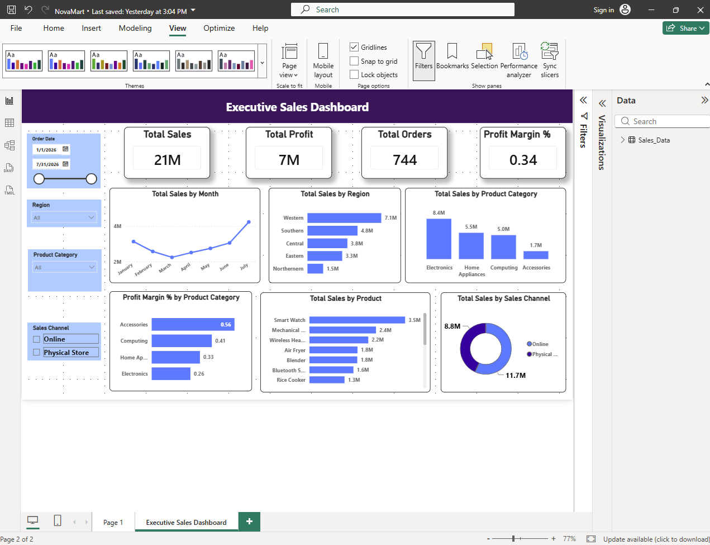

# NovaMart Executive Sales Dashboard – Power BI

A Power BI dashboard created for a sales analytics assignment to analyze sales, profit, orders, products, regions, and sales channels.

## Dashboard

## Tools Used

* Microsoft Power BI
* DAX
* Power Query

## Dashboard Includes

* Total Sales
* Total Profit
* Total Orders
* Profit Margin %
* Monthly Sales Trend
* Region vs Total Sales
* Product Category vs Total Sales
* Product Category vs Profit Margin %
* Top 5 Products by Total Sales
* Sales Channel vs Total Sales

## Slicers

* Order Date
* Region
* Product Category
* Sales Channel

## Business Problem

Looking only at Total Sales can hide low profitability. A product or category can have high sales but a low profit margin because of high costs or discounts.

## Management Recommendations

1. Focus on high-sales months and prepare sufficient stock.
2. Review pricing and costs of low-margin product categories.
3. Maintain sufficient stock and promote the top-selling products.

👨‍💻 Author:  
 Kavishka Dishan
